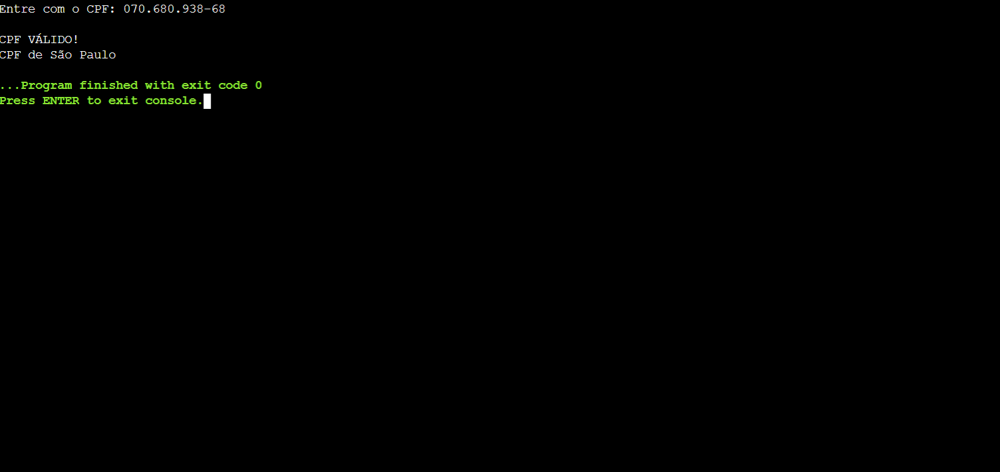

<h1 align="center"> Projeto C - Validador CPF </h1>

Projeto em Linguagem C durante o curso Análise e Desenvolvimento de Sistemas pela Fatec Ipiranga.

---

 

  

---
## 💻 Tecnologias

Esse projeto foi desenvolvido com as seguintes tecnologias:

- Linguagem C
- Git e Github

---

## 🚧 Projeto

Este é um Projeto em Linguagem C criado durante o curso ADS pela Fatec Ipiranga na Matéria Programação Estruturada e Modular. Onde o usuário consegue digitar um CPF, e o programa verifica se o CPF digitado é Válido.
Caso você digite o CNPJ com Pontos, Traços ou Barra o programa simplesmente ignora e apenas valida os Números.  

Você pode ver o Projeto e testar neste link: [Validador CPF - C](https://onlinegdb.com/QulW-9hMQ)

--- 
